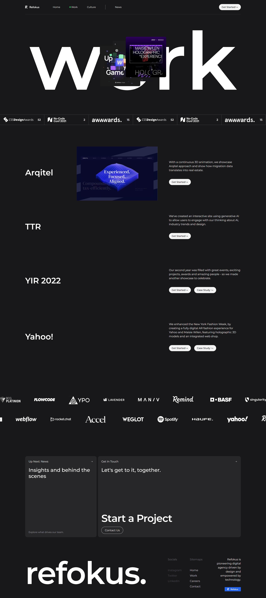

# Refokus Clone Website Project ✨

Welcome to the **Refokus Clone Website** project! This repository contains the source code for a **React-based clone** of the [Refokus](https://www.refokus.com) website. The goal of this project is to replicate the **design, layout, and functionality** of the original Refokus website while introducing additional features to improve **user experience** and **performance**.

## 🚀 Features

-   **Component-Based Architecture:** Built using **React JS**, ensuring modularity and ease of maintenance. Each section of the website is crafted as a reusable component.
-   **Smooth Animations:** Enhanced scrolling animations using **Locomotive Scroll**, along with animations for specific components like the **work section**, **project boxes**, and **marquee section**.
-   **On-Scroll and Hover Animations:** Integrated **on-scroll animations** in the work section, dynamically loading images as the user scrolls. Additionally, **on-hover video playback** for project boxes brings an interactive element.
-   **Visually Dynamic Marquee:** Leveraged **Framer Motion** for smooth marquee animations, offering a visually appealing experience.

## 🛠 Tech Stack

-   **React JS:** A powerful frontend library for building the website’s UI and managing state.
-   **Locomotive Scroll:** For implementing smooth and visually appealing scrolling animations.
-   **Framer Motion:** To create fluid and dynamic animations for components like the marquee.
-   **Tailwind CSS:** Provides utility-first styling to keep the design consistent and aligned with the original.
-   **Vercel:** Hosting platform used for **deployment** and ensuring fast and scalable performance for the live demo.

## 🔥 Enhancements Over Original Website

-   **Improved Smooth Scrolling:** Resolved the laggy scrolling behavior found in the original Refokus site, creating a more seamless and responsive user experience.
-   **Performance Optimization:** Optimized **page load speed**, improved transitions, and implemented performance tweaks to ensure smooth animations and faster loading times.
-   **Enhanced Interactivity:** Added custom hover effects and animations, especially in sections like the **cards** and **project box**, to make the website more engaging for users.

## 🌐 Live Demo

The project is deployed using **Vercel** and can be viewed live here: [Live Demo](#).

## 📸 Website Screenshot

## 🤝 Contributing

We welcome contributions to this project! If you have suggestions, encounter issues, or want to add new features, feel free to **open an issue** or **submit a pull request**. Together, we can make this project even better!

---

### Keywords for SEO Optimization

- Refokus website clone
- React-based website project
- Locomotive scroll animations
- Tailwind CSS website design
- React JS clone project
- Framer Motion animations
- Refokus website replica
- Smooth scrolling in React
- Web development with React and Tailwind

---

